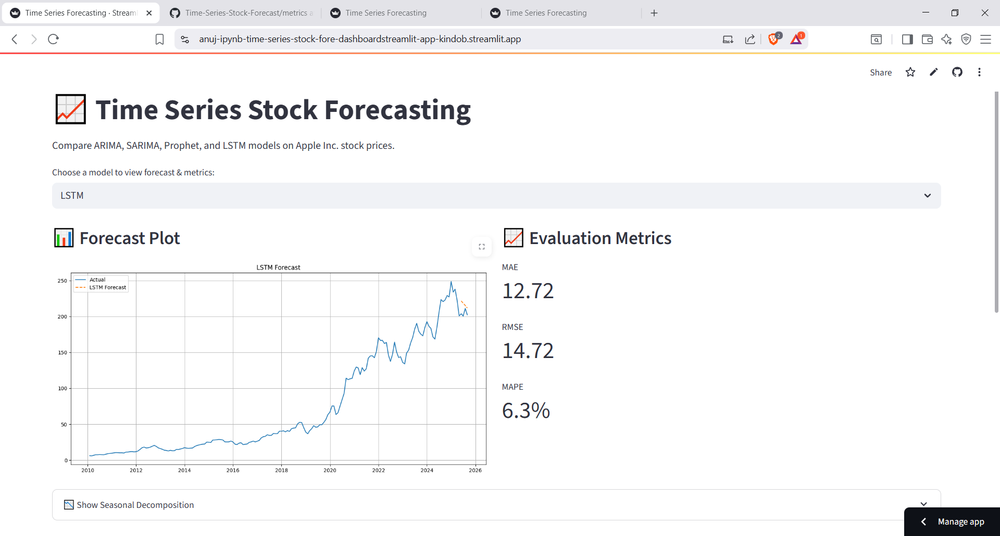

# 📈 Time Series Stock Forecasting Dashboard


[](https://anuj-ipynb-time-series-stock-fore-dashboardstreamlit-app-kindob.streamlit.app/)

---

## 📌 Overview

This project forecasts **Apple Inc. stock prices** using four time series models — **ARIMA**, **SARIMA**, **Prophet**, and **LSTM**. It features an interactive dashboard built with **Streamlit** that allows users to:

- Visualize and compare model forecasts
- Adjust forecast horizon (3–24 months)
- Upload custom stock CSVs
- Input stock tickers for live data fetch (via `yfinance`)
- Review model performance metrics (MAE, RMSE, MAPE)
- Display seasonal decomposition (if available)

---

## 🚀 Live App

👉 [Click here to view the deployed app](https://anuj-ipynb-time-series-stock-fore-dashboardstreamlit-app-kindob.streamlit.app/)

---

## 🛠️ Features

- 📊 Forecast comparison: ARIMA, SARIMA, Prophet, and LSTM
- 🔁 Dynamic forecast duration (via slider)
- 📈 Metrics: MAE, RMSE, and MAPE
- 📥 Upload your own stock CSVs
- 🔤 Enter custom ticker (e.g., MSFT, GOOGL) for real-time forecasting
- 📉 Seasonal decomposition (optional)
- 🧠 Automatic inference of best-performing model

---

## 📷 Preview



> ℹ️ Screenshot shows a live example with LSTM achieving best forecast accuracy on AAPL data.

---

## 🧩 Folder Structure

```plaintext
├── dashboard/
│   └── streamlit_app.py
├── models/
│   ├── arima_model.py
│   ├── sarima_model.py
│   ├── prophet_model.py
│   └── lstm_model.py
├── metrics/
│   ├── arima_metrics.json
│   ├── sarima_metrics.json
│   ├── prophet_metrics.json
│   └── lstm_metrics.json
├── data/
│   └── AAPL_cleaned.csv
├
│--dashboard_preview.png


## 📦 Installation

1. **Clone the repository**
```bash
git clone https://github.com/your-username/time-series-stock-forecast.git
cd time-series-stock-forecast
````

2. **Install dependencies**

```bash
pip install -r requirements.txt
```

3. **Run the app**

```bash
streamlit run dashboard/streamlit_app.py
```

---

## 📌 Usage

Use the sidebar to:

* ✅ Choose a model
* 📁 Upload your own CSV file
* 🏷️ Enter a stock ticker (e.g., `AAPL`, `MSFT`)
* 📆 Select forecast horizon
* 🔍 Click **"Show Seasonal Decomposition"** to analyze trends

---

## 🛠️ Tech Stack

* **Frontend:** Streamlit
* **Data Handling:** Pandas, NumPy
* **Visualization:** Matplotlib, Seaborn
* **Models:**

  * ARIMA / SARIMA via `statsmodels` and `pmdarima`
  * Prophet via `prophet`
  * LSTM via `TensorFlow / Keras`
* **Live Data Source:** `yfinance`

---

## ✅ Evaluation Metrics Explained

| Metric   | Description                                       |
| -------- | ------------------------------------------------- |
| **MAE**  | Mean Absolute Error – average magnitude of errors |
| **RMSE** | Root Mean Squared Error – penalizes large errors  |
| **MAPE** | Mean Absolute Percentage Error – shows error in % |

---

## 🧪 Sample Metrics

| Model    | MAE         | RMSE        | MAPE        |
| -------- | ----------- | ----------- | ----------- |
| ARIMA    | 15.3        | 18.9        | 8.9%        |
| SARIMA   | 14.7        | 17.1        | 7.4%        |
| Prophet  | 13.9        | 15.2        | 7.1%        |
| **LSTM** | ✅ **12.72** | ✅ **14.72** | ✅ **6.30%** |

🏆 **Best Performing Model: LSTM**

---

## 🧩 Future Enhancements

* ✅ Multi-ticker batch forecasting
* ✅ Trade signal overlays
* ⏳ Model explainability (e.g., SHAP, attention)
* ⏳ Cross-validation & statistical tests (e.g., Diebold-Mariano)
* ⏳ Support for crypto, commodities, and forex

---

## 🙏 Acknowledgments

* [Streamlit](https://streamlit.io/)
* [pmdarima](https://alkaline-ml.com/pmdarima/)
* [Prophet](https://facebook.github.io/prophet/)
* [yfinance](https://pypi.org/project/yfinance/)
* Apple Inc. stock data via Yahoo Finance

---

## 📧 Contact

**Anuj Srinivas**
[LinkedIn](https://www.linkedin.com/in/anujsrinivas) • [GitHub](https://github.com/anuj-ai)


```


